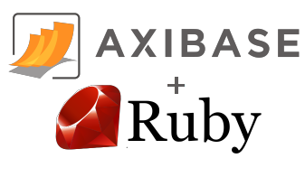

# ATSD Ruby Client



## Table of Contents

* [Overview](#overview)
* [Implemented Methods](#implemented-methods)
* [Installing Ruby Client](#installing-ruby-client)
* [Usage](#usage)
* [Development](#development)

## Overview

**ATSD Ruby Client** enables Ruby developers to read and write statistics and metadata from [Axibase Time Series Database](https://axibase.com/docs/atsd/).

For more information about the ATSD API, refer to [ATSD API Documentation](https://axibase.com/docs/atsd/api/).
    
## Implemented Methods

The **ATSD Client for Ruby** provides an easy-to-use client for interfacing with **ATSD** metadata and data REST API services.
It has the ability to read and write time series values, statistics, properties, alerts, and messages.

### [REST API](https://axibase.com/docs/atsd/api/data/)

The REST API allows you to insert and retrieve data from the database using HTTP requests.

#### Series

* [Series: `query`](https://axibase.com/docs/atsd/api/data/series/query.html)<br>
  Retrieves time series objects for the specified metric, entity, tags, and date range. Applies common time series transformations including aggregation, interpolation, downsampling etc.

* [Series: `insert`](https://axibase.com/docs/atsd/api/data/series/insert.html)<br>
  Inserts a timestamped array of numbers for a given series identified by metric, entity, and series tags.

* [Series: `insert CSV`](https://axibase.com/docs/atsd/api/data/series/csv-insert.html)<br>
  Inserts series values for the specified entity and series tags in CSV format.

#### Properties

* [Properties: `query`](https://axibase.com/docs/atsd/api/data/properties/query.html)<br>
  Retrieves property records for the specified filters including type, entity, key, and time range.

* [Properties: `get types`](https://axibase.com/docs/atsd/api/data/properties/list-types.html)<br>
  Returns an array of property types for the entity.

* [Properties: `insert`](https://axibase.com/docs/atsd/api/data/properties/insert.html)<br>
  Inserts an array of properties.

* [Properties: `delete`](https://axibase.com/docs/atsd/api/data/properties/delete.html)<br>
  Deletes property records that match specified filters.

#### Messages

* [Messages: `query`](https://axibase.com/docs/atsd/api/data/messages/query.html)<br>
  Retrieves message records for the specified filters.

* [Messages: `insert`](https://axibase.com/docs/atsd/api/data/messages/insert.html)<br>
  Inserts messages.

#### Alerts

* [Alerts: `query`](https://axibase.com/docs/atsd/api/data/alerts/query.html)<br>
  Retrieves open alerts for specified filters.

* [Alerts: `update`](https://axibase.com/docs/atsd/api/data/alerts/update.html)

* [Alerts: `history query`](https://axibase.com/docs/atsd/api/data/alerts/history-query.html)<br>
  Retrieves a list of closed alerts matching specified fields.

### [Meta API](https://axibase.com/docs/atsd/api/meta/)

The Meta API allows you to query metadata for metrics, entities, and entity groups in the database.

#### Metrics

* [Metric: `get`](https://axibase.com/docs/atsd/api/meta/metric/get.html)<br>
  Retrieves properties and tags for the specified metric.

* [Metric: `update`](https://axibase.com/docs/atsd/api/meta/metric/update.html)<br>
  Updates fields and tags of the specified metric.

* [Metric: `create or replace`](https://axibase.com/docs/atsd/api/meta/metric/create-or-replace.html)<br>
  Creates a metric with specified fields and tags or replaces the fields and tags of an existing metric.

* [Metric: `delete`](https://axibase.com/docs/atsd/api/meta/metric/delete.html)<br>
  Deletes the specified metric.

* [Metric: `series tags`](https://axibase.com/docs/atsd/api/meta/metric/series-tags.html)<br>
  Retrieves unique series tags values for the specified metric.

#### Entities

* [Entity: `get`](https://axibase.com/docs/atsd/api/meta/entity/get.html)<br>
  Retrieves fields and tags describing the specified entity.

* [Entity: `update`](https://axibase.com/docs/atsd/api/meta/entity/update.html)<br>
  Updates fields and tags of the specified entity.

* [Entity: `create or replace`](https://axibase.com/docs/atsd/api/meta/entity/create-or-replace.html)<br>
  Creates an entity with specified fields and tags or replaces the fields and tags of an existing entity.

* [Entity: `delete`](https://axibase.com/docs/atsd/api/meta/entity/delete.html)<br>
  Deletes the specified entity and removes the entity from any entity groups it belongs to.

* [Entity: `metrics`](https://axibase.com/docs/atsd/api/meta/entity/metrics.html)<br>
  Retrieves a list of metrics collected by the entity.
  
#### Entity Groups

* [Entity Group: `get`](https://axibase.com/docs/atsd/api/meta/entity-group/get.html)<br>
  Retrieves information about the specified entity group including its name and user-defined tags.

* [Entity Group: `update`](https://axibase.com/docs/atsd/api/meta/entity-group/update.html)<br>
  Updates fields and tags of the specified entity group.

* [Entity Group: `create or replace`](https://axibase.com/docs/atsd/api/meta/entity-group/create-or-replace.html)<br>
  Creates an entity group with specified fields and tags or replaces the fields and tags of an existing entity group.

* [Entity Group: `delete`](https://axibase.com/docs/atsd/api/meta/entity-group/delete.html)<br>
  Deletes the specified entity group.

* [Entity Group: `get entities`](https://axibase.com/docs/atsd/api/meta/entity-group/get-entities.html)<br>
  Retrieves a list of entities that are members of the specified entity group and are matching the specified filter conditions.

* [Entity Group: `add entities`](https://axibase.com/docs/atsd/api/meta/entity-group/get-entities.html)<br>
  Retrieves a list of entities that are members of the specified entity group and are matching the specified filter conditions.

* [Entity Group: `set entities`](https://axibase.com/docs/atsd/api/meta/entity-group/set-entities.html)<br>
  Sets members of the entity group from the specified entity list.

* [Entity Group: `delete entities`](https://axibase.com/docs/atsd/api/meta/entity-group/delete-entities.html)<br>
  Removes the specified members from the entity group.

---

## Installing Ruby Client

Append this line to the Gemfile of the target application:

```ruby
gem 'atsd'
```

Then execute:

```sh
bundle
```

Alternatively, install the `atsd` gem manually:

```sh
gem install atsd
```

## Usage

To start using the gem you need to create an `ATSD` class instance:

```ruby
require 'atsd'
include ATSD
atsd = ATSD.new :url => "#{API_ENDPOINT}/api/v1", 
                :basic_auth => "#{LOGIN}:#{PASSWORD}", 
                :logger => true
```

### Configuration

#### Authorization

In order to use the API, specify the `:basic_auth` option with either of these options:

* `"login:password"`
* `{ :login => 'login', :password => 'password' }`

#### SSL

Connecting to ATSD via SSL requires extra configuration if your ATSD instance runs on a self-signed SSL certificate.

Refer to one of the following tutorials to install a specific kind of SSL certificate to your ATSD instance:

* [Self-Signed Certificate](https://axibase.com/docs/atsd/administration/ssl-self-signed.html)
* [CA-Signed Certificate](https://axibase.com/docs/atsd/administration/ssl-ca-signed.html)
* [`Let's Encrypt` Certificate](https://axibase.com/docs/atsd/administration/ssl-lets-encrypt.html)

As a workaround, specify the `ssl: { verify: false }` option in the client.

#### Logging

* To use a custom logger specify the logger in the `:logger` option.
* To use the default STDOUT logger set the `:logger` option to `true`.

### Services

Once you have instantiated the `ATSD` class, you can access each of the available services. Each service represents a particular object type in ATSD.

The following services are available:

* `series_service`
* `properties_service`
* `messages_service`
* `alerts_service`
* `metrics_service`
* `entities_service`
* `entity_groups_service`

#### Query builders

Query objects created by services provide convenient methods to build complex queries. These objects support method chaining and automatically translate `snake_styled` properties to CamelCase, used by the API. For example, the `end_time` property in ruby code becomes `endTime` in a JSON request.

#### Series Service

Basic query:

```ruby
require 'time'
series_service = atsd.series_service
# => #<ATSD::SeriesService:0x007f82a4446c08
query = series_service.query('sensor-1', 'temperature', "2015-11-17T12:00:00Z", "2015-11-17T19:00:00Z")
# => {:entity=>"sensor-1", :metric=>"temperature", :start_date=>"2015-11-17T12:00:00Z", :end_date=>"2015-11-17T19:00:00Z"}

query.class
# => ATSD::SeriesQuery

query.execute
# => [{:entity=>"sensor-1",
#    :metric=>"temperature",
#    :tags=>{},
#    :type=>"HISTORY",
#    :aggregate=>{"type"=>"DETAIL"},
#    :data=>
#     [{"t"=>1428301869000, "v"=>24.0},
#      {"t"=>1428301884000, "v"=>23.0},
#      {"t"=>1428301899000, "v"=>23.5},
# ...

query.result
# same result

s = query.result.first
s.entity
# => "sensor-1"
```

Aggregated query:

```ruby
query.aggregate(types:[SeriesQuery::AggregateType::AVG], period:{count:1, unit:SeriesQuery::Period::HOUR})
# => {:entity=>"sensor-1",
#  :metric=>"temperature",
#  :end_time=>1428303004000,
#  :aggregate=>{:types=>["AVG"], :period=>{:count=>1, :unit=>"HOUR"}}}

query.execute
# => [{:entity=>"sensor-1",
#   :metric=>"temperature",
#   :tags=>{},
#   :type=>"HISTORY",
#   :aggregate=>{"type"=>"AVG", "period"=>{"count"=>1, "unit"=>"HOUR"}},
#   :data=>[{"t"=>1428300000000, "v"=>23.57}]}]
```

Query with versions:

```ruby
query = atsd.series_service.query("sensor-2", "pressure", Time.parse("2015-11-17T12:00:00Z"), Time.parse("2015-11-17T19:00:00Z"), {:versioned => true})
query.execute
template = "%24s,   %13s,   %24s,   %17s,   %17s\n"
output = sprintf(template, "sample_date", "sample_value", "version_date", "version_source", "version_status")
query.result.each do |data|
    samples = data.data.sort_by{|sample| sample["version"]["d"]}
    samples.each {|sample| output << sprintf(template, sample["d"], sample["v"], sample["version"]["d"], sample["version"]["source"], sample["version"]["status"])  }
end
puts output
            sample_time,    sample_value,              version_time,      version_source,      version_status
   2015-11-17T17:00:00Z,             7.0,      2015-11-18T19:19:57Z,           gateway-1,              normal
   2015-11-17T18:00:00Z,            17.0,      2015-11-18T19:19:57Z,           gateway-1,               error
   2015-11-17T17:00:00Z,             7.0,      2015-11-18T19:22:05Z,           gateway-1,              normal
   2015-11-17T18:00:00Z,            17.0,      2015-11-18T19:22:05Z,           gateway-1,               error
   2015-11-17T17:00:00Z,             7.0,      2015-11-18T19:23:28Z,           gateway-1,              normal
   2015-11-17T18:00:00Z,            17.0,      2015-11-18T19:23:28Z,           gateway-1,               error
   2015-11-17T17:00:00Z,             7.0,      2015-11-18T19:36:18Z,           gateway-1,              normal
   2015-11-17T18:00:00Z,            17.0,      2015-11-18T19:36:18Z,           gateway-1,               error
   2015-11-17T17:00:00Z,             7.0,      2015-11-18T19:37:02Z,           gateway-1,              normal
   2015-11-17T18:00:00Z,            17.0,      2015-11-18T19:37:02Z,           gateway-1,               error
   2015-11-17T17:00:00Z,             7.0,      2015-11-18T20:41:10Z,           gateway-1,              normal
   2015-11-17T18:00:00Z,            17.0,      2015-11-18T20:41:10Z,           gateway-1,               error
   2015-11-17T17:00:00Z,             7.0,      2015-11-18T20:45:57Z,           gateway-1,              normal
   2015-11-17T18:00:00Z,            17.0,      2015-11-18T20:45:57Z,           gateway-1,               error
   2015-11-17T17:00:00Z,             7.0,      2015-11-19T11:25:40Z,           gateway-1,              normal
   2015-11-17T18:00:00Z,            17.0,      2015-11-19T11:25:40Z,           gateway-1,               error
   2015-11-17T17:00:00Z,             7.0,      2015-11-19T11:29:36Z,           gateway-1,              normal
   2015-11-17T18:00:00Z,            17.0,      2015-11-19T11:29:36Z,           gateway-1,               error
   2015-11-17T17:00:00Z,             7.0,      2015-11-19T11:32:35Z,           gateway-1,              normal
   2015-11-17T18:00:00Z,            17.0,      2015-11-19T11:32:35Z,           gateway-1,               error
```

Inserting Series:

```ruby
s = Series.new
s.entity = 'sensor-1'
s.metric = 'temperature'
s.data = [ {d: Time.now.iso8601, v: 22} ]
atsd.series_service.insert(s)
```

Inserting series using Sample class:

```ruby
s = Series.new
s.entity = 'sensor-1'
s.metric = 'pressure'
sample = Sample.new :date => "2015-11-17T17:00:00Z", :value => 7, :version => {:status => "normal", :source => "gateway-1"}
s.data = [ sample ]
series_service.insert(s)
```

Inserting Series with Versions:

```ruby
sample_1 = Sample.new :date => "2015-11-17T17:00:00Z", :value => 7, :version => {:status => "normal", :source => "gateway-1"}
sample_2 = Sample.new :date => "2015-11-17T18:00:00Z", :value => 17, :version => {:status => "error", :source => "gateway-1"}
series = Series.new :entity => "sensor-1", :metric => "pressure", :data => [sample_1, sample_2]
atsd.series_service.insert(series)
```

**CSV Insert**:

`data.csv` contents:

```csv
time, pressure, temperature
1447228800000, 39,    29.23
1447315200000, 32,    29.24
1447401600000, 40,    29.23
1447488000000, 37,    29.25
1447574400000, 39,    29.26
1447660800000, 37,    29.21
1447747200000, 38,    29.20
1447833600000, 36,    29.23
1447920000000, 37,    29.25
1448006400000, 38,    29.25
```

Inserting CSV data from file:

```ruby
series_service.csv_insert('sensor-1', File.read('/path/to/data.csv'), { :user => 'beta' })
```

Retrieving series values in CSV and JSON format:

```ruby
series_service.url_query('json','nurswgvml007','cpu_busy', :startDate => 'previous_minute', :endDate => 'now')
# => {"series"=>
#  [{"entity"=>"nurswgvml007",
#    "metric"=>"cpu_busy",
#    "tags"=>{},
#    "type"=>"HISTORY",
#    "aggregate"=>{"type"=>"DETAIL"},
#    "data"=>[{"t"=>1464688814000, "v"=>3.03}, {"t"=>1464688830000, "v"=>5}, {"t"=>1464688846000, "v"=>9}, {"t"=>1464688862000, "v"=>4.04}, {"t"=>1464688878000, "v"=>5.05}]}]}
series_service.url_query('csv','nurswgvml007','cpu_busy', :startDate => 'previous_minute', :endDate => 'now')
=> "time,entity,metric,value\r\n1464688862000,nurswgvml007,cpu_busy,4.04\r\n1464688878000,nurswgvml007,cpu_busy,5.05\r\n1464688894000,nurswgvml007,cpu_busy,10.2\r\n1464688910000,nurswgvml007,cpu_busy,45.95\r\n1464688926000,nurswgvml007,cpu_busy,21.36\r\n1464688942000,nurswgvml007,cpu_busy,4.04\r\n"
```

#### Properties Service

```ruby
properties_service = atsd.properties_service
# => #<ATSD::PropertiesService:0x007f82a456e6f8

property = Property.new :entity => 'sensor-1', :type => 'sensor_type', :tags => {"location":"NUR","site":"building-1"}, :key => {"id": "ch-15"}
properties_service.insert(property)

properties_service.query('sensor-1', 'sensor_type', :start_date => '2015-11-17T17:00:00Z', :end_date => '2016-01-17T17:00:00Z').execute
# => [{:type=>"sensor_type",
#  :entity=>"sensor-1",
#  :tags=>{"location"=>"NUR", "site"=>"building-1"},
#  :d=>"2016-05-30T12:16:31Z",
#  :key=>{"id"=>"ch-15"}}]

properties_service.delete(property)
properties_service.query('sensor-1', 'sensor_type', :start_date => '2015-11-17T17:00:00Z', :end_date => '2016-01-17T17:00:00Z').execute
# => []

properties_service.type_query('sensor-1')
# => ["com.axibase.config",
# "configuration",
# "cpu",
# "disk",
# "sw.vmw.vm",
# "system",

properties_service.url_query('nurswgvml007','network')
# => [{"type"=>"network", "entity"=>"nurswgvml007", "key"=>{"id"=>"eth1"}, "tags"=>{"network_i/o.read-kb/s"=>"261.9", "network_i/o.write-kb/s"=>"209.9", "network_packets.read/s"=>"354.4", "network_packets.write/s"=>"339.4"}, "timestamp"=>1464680627000},
# {"type"=>"network", "entity"=>"nurswgvml007", "key"=>{"id"=>"lo"}, "tags"=>{"network_i/o.read-kb/s"=>"2.7", "network_i/o.write-kb/s"=>"2.7", "network_packets.read/s"=>"6.7", "network_packets.write/s"=>"6.7"}, "timestamp"=>1464680627000}]
```

#### Messages Service

```ruby
messages_service = atsd.messages_service
# => #<ATSD::MessagesService:0x000000024156e8

message = Message.new entity: "sensor-1", type: "logger", message: "Processing file"
messages_service.insert(message)

messages_service.query("sensor-1", :limit => 5, :endDate => "now", :interval => {:count => 5, :unit => "MINUTE"}).execute
# => [{"entity"=>"sensor-1", "type"=>"logger", "source"=>"default", "severity"=>"NORMAL", "message"=>"Processing file", "date"=>"2016-06-27T14:13:17.580Z"}]

messages_service.stats_query(:entity => "sensor-1", :startDate => "current_day", :endDate => "now")
#  => [{"entity"=>"sensor-1", "metric"=>"message-count", "tags"=>{}, "type"=>"HISTORY", "aggregate"=>{"type"=>"COUNT", "interval"=>{"count"=>51363229, "unit"=>"MILLISECOND"}}, "data"=>[{"d"=>"2016-06-27T00:00:00.000Z", "v"=>1}]}]

messages_service.stats_query(:entity => "sensor-1", :startDate => "current_day", :endDate => "now", :groupKeys => "type")
#  => [{"entity"=>"sensor-1", "metric"=>"message-count", "tags"=>{"type"=>"backup"}, "type"=>"HISTORY", "aggregate"=>{"type"=>"COUNT", "interval"=>{"count"=>50071806, "unit"=>"MILLISECOND"}}, "data"=>[{"d"=>"2016-06-27T00:00:00.000Z", "v"=>4}]},
#  {"entity"=>"sensor-1", "metric"=>"message-count", "tags"=>{"type"=>"logger"}, "type"=>"HISTORY", "aggregate"=>{"type"=>"COUNT", "interval"=>{"count"=>50071806, "unit"=>"MILLISECOND"}}, "data"=>[{"d"=>"2016-06-27T00:00:00.000Z", "v"=>1485}]},
#  {"entity"=>"sensor-1", "metric"=>"message-count", "tags"=>{"type"=>"security"}, "type"=>"HISTORY", "aggregate"=>{"type"=>"COUNT", "interval"=>{"count"=>50071806, "unit"=>"MILLISECOND"}}, "data"=>[{"d"=>"2016-06-27T00:00:00.000Z", "v"=>272}]}]

messages_service.stats_query(:entity => "sensor-1", :startDate => "current_day", :endDate => "now", "groupKeys" => "type", "aggregate" => {"type" => "COUNT", "period" => {"count" => 12, "unit" => "HOUR"}})
# => [{"entity"=>"sensor-1", "metric"=>"message-count", "tags"=>{"type"=>"backup"}, "type"=>"HISTORY", "aggregate"=>{"type"=>"COUNT", "period"=>{"count"=>12, "unit"=>"HOUR"}}, "data"=>[{"d"=>"2016-06-27T00:00:00.000Z", "v"=>4}]},
# {"entity"=>"sensor-1",
#  "metric"=>"message-count",
#  "tags"=>{"type"=>"logger"},
#  "type"=>"HISTORY",
#  "aggregate"=>{"type"=>"COUNT", "period"=>{"count"=>12, "unit"=>"HOUR"}},
#  "data"=>[{"d"=>"2016-06-27T00:00:00.000Z", "v"=>1235}, {"d"=>"2016-06-27T12:00:00.000Z", "v"=>253}]},
# {"entity"=>"sensor-1",
#  "metric"=>"message-count",
#  "tags"=>{"type"=>"security"},
#  "type"=>"HISTORY",
#  "aggregate"=>{"type"=>"COUNT", "period"=>{"count"=>12, "unit"=>"HOUR"}},
#  "data"=>[{"d"=>"2016-06-27T00:00:00.000Z", "v"=>232}, {"d"=>"2016-06-27T12:00:00.000Z", "v"=>40}]}]

```

#### Alerts Service

```ruby
alerts_service = atsd.alerts_service
# => #<ATSD::AlertsService:0x007faf7c0efdc0

alerts_service.query(:entity => "sensor-1", :metrics => ["meminfo.active"], :start_date => '2015-11-17T17:00:00Z', :end_date => '2016-01-17T17:00:00Z').execute
# => [{"entity"=>"sensor-1",
#  "tags"=>{},
#  "repeatCount"=>79,
#  "textValue"=>"21.9",
#  "metric"=>"meminfo.active",
#  "severity"=>3,
#  "rule"=>"memory info",
#  "openDate"=>"2016-05-30T12:33:07Z",
#  "lastEventDate"=>"2016-05-30T13:52:11Z",
#  "acknowledged"=>false,
#  "openValue"=>100.0,
#  :v=>21.9,
#  "id"=>8}]
```

#### Metrics Service

```ruby
metrics_service = atsd.metrics_service
# => #<ATSD::MetricsService:0x007fbb548d9548

metrics_service.list(:limit => 10)
# => [{:name=>"activemq_metrics_count",
#     :enabled=>true,
#     :data_type=>"FLOAT",
#     :counter=>false,
#     :persistent=>true,
#     :time_precision=>"MILLISECONDS",
#     :retention_interval=>0,
#     :invalid_action=>"NONE",
#     :last_insert_time=>1428328861848},
#     :versioned=>true
#    {:name=>"activemq_properties_count",
#     :enabled=>true,
#     :data_type=>"FLOAT",
#     :counter=>false,
#     :persistent=>true,
# ...

metrics_service.series("disk_used", "entity" => "nurswgvml007")
# => => [{"metric"=>"disk_used", "entity"=>"nurswgvml007", "tags"=>{"file_system"=>"/dev/mapper/vg_nurswgvml007-lv_root", "mount_point"=>"/"}, "lastInsertDate"=>"2016-06-21T11:47:17.000Z"},
      {"metric"=>"disk_used", "entity"=>"nurswgvml007", "tags"=>{"file_system"=>"10.102.0.2:/home/store/share", "mount_point"=>"/mnt/share"}, "lastInsertDate"=>"2015-12-25T14:09:49.000Z"},
      {"metric"=>"disk_used", "entity"=>"nurswgvml007", "tags"=>{"file_system"=>"//u113452.your-backup.de/backup", "mount_point"=>"/mnt/u113452"}, "lastInsertDate"=>"2016-06-21T11:47:17.000Z"}]


metrics_service.series("disk_used", "entity" => "nurswgvml007", "tags.mount_point" => "/")
# => [{"metric"=>"disk_used", "entity"=>"nurswgvml007", 
    "tags"=>{"file_system"=>"/dev/mapper/vg_nurswgvml007-lv_root", "mount_point"=>"/"}, 
    "lastInsertDate"=>"2016-06-21T11:36:16.000Z"}]

metric = Metric.new
# => {}
metric.name = "energy_usage"
# => "energy_usaget"
metric.versioned = true
# => true
metrics_service.create_or_replace(metric)
metrics_service.get("energy_usage")
# => {:name=>"energy_usage", :enabled=>true, :data_type=>"FLOAT", :counter=>false, :persistent=>true, :tags=>{}, :time_precision=>"MILLISECONDS", :retention_interval=>0, :invalid_action=>"NONE", :versioned=>true}

```

#### Entities Service

```ruby
entities_service = atsd.entities_service
# => #<ATSD::EntitiesService:0x007f82a45b40b8

entities_service.list(:limit => 10)
# => [{:name=>"atsd", :enabled=>true, :last_insert_time=>1428304482631},
#  {:name=>"mine", :enabled=>true},
#  {:name=>"test_entity", :enabled=>true, :last_insert_time=>1428304489000},
#  {:name=>"sensor-1", :enabled=>true, :last_insert_time=>1428304489000}]

entities_service.get('sensor-1')
# => {:name=>"sensor-1", :enabled=>true, :last_insert_time=>1428304499000, :tags=>{}}

entities_service.metrics('server-1')
# => [{:name=>"df.disk_size",
#   :enabled=>true,
#   :data_type=>"FLOAT",
#   :counter=>false,
#   :persistent=>true,
#   :time_precision=>"MILLISECONDS",
#   :retention_interval=>0,
#   :invalid_action=>"NONE",
#   :last_insert_time=>1428304499000},
#  {:name=>"df.disk_used",
#   :enabled=>true,
# ...

entities_service.delete(entities_service.get('server-1')) # or entities_service.delete('server-1')
entities_service.list
# => [{:name=>"atsd", :enabled=>true, :last_insert_time=>1428304482631},
#  {:name=>"test_entity", :enabled=>true, :last_insert_time=>1000000000},
#  {:name=>"sensor-1", :enabled=>true, :last_insert_time=>1428304489000}]

entities_service.entity_groups("nurswgvml007")
# => [{"name"=>"VMware VMs", "tags"=>{}},
# {"name"=>"java-loggers", "tags"=>{}},
# {"name"=>"java-virtual-machine", "tags"=>{}},
# {"name"=>"jetty-web-server", "tags"=>{}},
```

#### Entity Groups Service 

```ruby
entity_groups_service = atsd.entity_groups_service
# => #<ATSD::EntityGroupsService:0x007fb1b2a0d7f8

entity_groups_service.create_or_replace('group1')
entity_groups_service.list
# => [{:name=>"group1"}]

entity_groups_service.add_entities('group1', [{name:'entity1'},{name:'entity2'}])
entity_groups_service.get_entities(entity_groups_service.get('group1'))
# => [{:name=>"entity1", :enabled=>true}, {:name=>"entity2", :enabled=>true}]

entity_groups_service.delete_entities('group1', [{name:'entity1'},{name:'entity2'}])
entity_groups_service.get_entities('group1')
# => []

entity_groups_service.get_entities("java-loggers", :limit => 3, :timeFormat => "iso")
# => [{"name"=>"-last-https-test-drive", "enabled"=>true, "lastInsertDate"=>"2016-05-19T11:22:05.710Z"},
# {"name"=>"12364bc005b2", "enabled"=>true, "lastInsertDate"=>"2016-05-19T22:26:50.432Z"},
# {"name"=>"1d99e87f5a89", "enabled"=>true, "lastInsertDate"=>"2016-04-18T16:53:51.563Z"}]


```

### Errors

If a request is unsuccessful an `ATSD::APIError` exception is raised. Retrieve message and HTTP status code using the `message` and `status` fields.

### Low-level API Client

The `ATSD` gem also provides an `ATSD::Client` class. This class is a simple API wrapper, which uses [Faraday](https://github.com/lostisland/faraday) to handle HTTP-related routines. All services are built on top of this library.

Access the `Faraday::Connection` object using the client `connection` field if necessary.

## Development

Run `bin/setup` to install dependencies. Then run `bin/console` for an interactive prompt that will allow you to experiment with the client.

To install this gem to a local machine, run `bundle exec rake install`.